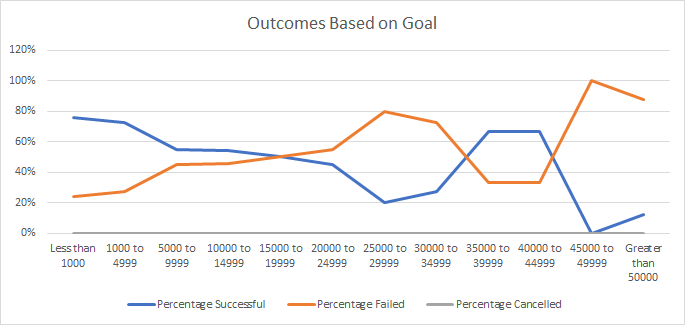

# kickstarter-analysis
Analysis of Kickstarters to reveal trends
## Overview of Project
The project is going to be an analyzation of Theater outcomes based on their launch date and more specifically outcomes of Plays based on their fundraising goals.
### Purpose
"Fever", Louise's play, did not take long to get close to their fundraising goal. The data analyzed in this section is to figure out how other theater kickstarter campaigns compared to based on their launch dates and fundraising goals.
## Analysis and Challenges
### Analysis of Outcomes Based on Launch Date
The trends in the Outcomes Based on Launch Date analysis were very similar in both of the successful and failed data. The successful theater outcomes were mostly between April and May and went decreased until they increased a bit in October. The lowest amount of successful theater outcomes was in December. As we can see on the graph below, the number of failed theater outcomes was almost the same between May and August. The highest amounnt of failed theater outcomes were launched in May and October. There were almost the same amount of the cancelled theater kickstarters each month. There were only 37 overall theater kickstarters that were cancelled compared to the 1369 total campaigns.
https://onedrive.live.com/?cid=698B51F469A30C42&id=698B51F469A30C42%217079&parId=698B51F469A30C42%217076&o=OneUp
### Analysis of Outcomes Based on Goals
There was a very wide range of goals in the total 1047 kickstarter campaigns for Plays, specifically. Almost 80% of the goals less than $1000 were successful and a lower, 24% failed with a goal of less than $1000. As the goals got higher, there were less successful outcomes, until the $35000 to $44999 range where about 67% were successful. This being said, there were only 9 total projects during those ranges, compared to the 186 that had a goal of less than $1000. The range of $1000 to $4999 had the most amount of total projects and after that point is where we start to see a more steady decrease in successful projects. It continues to decline slowly until the $20000 to $24999 goal and then there is a rapid decrease. So overall, as the goal amount gets larger, the amount of successful campaigns for plays goes up and failed goes down. See below for the graph showing how they related.

### Challenges and Difficulties Encountered
## Results
The most successful amount of theater campaigns were launched in May and June, therefore, it would be a great idea to start a campaign of this nature during one of those months. The worst month to launch a campaign for a theater project is in December. 
One conclusion we can draw from the kickstarter campaigns for plays based on goal amount is that 
There are few limitations to this data set. Some of the campaigns for plays had high goals, but there were not many of those with high goals. This makes it look like there is a high amount of successful play campaigns with high goals when there were really only a few. I would suggest making another box and whisker plot of the amount of successful and failed play campaigns so that we can see the amounts and not just the percentages. Another suggestion would be to filter the theater outcomes by launch date by years and research the economy in those years. We would need to take into consideration if people/places are able to donate during the current economy. 
